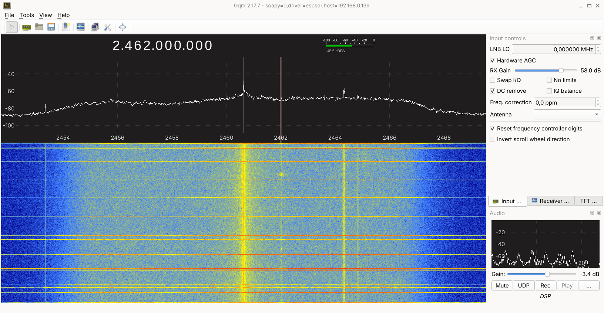

# SoapyESPSDR

<a href="https://espargos.net/"></a>

SoapyESPSDR is a SoapySDR transceiver driver for ESP-SDR by
[ESPARGOS](https://espargos.net/).

ESP-SDR is firmware for the ESP32-S31 Function-CoreBoard that provides native
I/Q receive and continuous arbitrary-I/Q transmit over Gigabit Ethernet and
the native high-speed USB interface. SoapyESPSDR makes it available to
applications that support SoapySDR, including Gqrx, GNU Radio, and SDR++.

On Ethernet the driver uses HTTP control and UDP I/Q; on USB it uses the
firmware's vendor control and bulk-IQ endpoints. It checks firmware and
transport sequence numbers and reports any missing samples as SoapySDR
overflow events.



*ESP-SDR receiving the 2.4 GHz band in Gqrx.*

## Requirements

You need:

- An ESP32-S31 Function-CoreBoard running ESP-SDR firmware
- For Ethernet, the board and computer on the same IPv4 network
- SoapySDR 0.8 development files
- libcurl, jsoncpp, zlib, and libusb-1.0 development files
- CMake and a C++17 compiler

The board normally obtains its address through DHCP and is available as
`esp-sdr.local`. If mDNS is unavailable on your computer, use the board's IPv4
address instead.

Only one computer can receive the I/Q stream at a time. ESP-SDR does not use
authentication and should only be used on a trusted network.

## Build

```sh
cmake -S . -B build -DCMAKE_BUILD_TYPE=Release
cmake --build build -j
```

To use the driver without installing it, point SoapySDR at the build directory:

```sh
export SOAPY_SDR_PLUGIN_PATH="$PWD/build"
```

Confirm that SoapySDR can find the receiver:

```sh
SoapySDRUtil --find="driver=espsdr,host=esp-sdr.local"
SoapySDRUtil --probe="driver=espsdr,host=esp-sdr.local"
```

Replace `esp-sdr.local` with an IPv4 address when necessary, for example:

```sh
SoapySDRUtil --probe="driver=espsdr,host=192.168.0.139"
```

On a multi-homed host, `interface=<name>` binds HTTP control and both UDP
directions without changing system routes:

```sh
SoapySDRUtil --probe="driver=espsdr,host=192.168.0.139,interface=enp0s13f0u1u1"
```

An explicit `host` always selects Ethernet even when USB is attached.

## USB transport

When the board's native high-speed USB port is connected, the same control
and streaming interface is available without a network. USB devices are
discovered automatically:

```sh
SoapySDRUtil --find="driver=espsdr"
SoapySDRUtil --probe="driver=espsdr,usb=1"
```

Select a specific board with `usb_serial=<serial>` (the serial is the base
MAC address, shown by `--find`). One combined firmware image keeps Ethernet
and USB control available together; the most recent RX stream start owns the
half-duplex sample engine.

USB RX uses compact native `IQC8` at the selected RX rate. USB TX arms exact-size
device allocations, transfers packed IQ10 words in 4 KiB bulk chunks, and
queues them to the live TXDC engine without a second device-side waveform
copy. Shorter OUT transactions reduce contention with the realtime PSRAM
reader and materially improve arbitrary-waveform fidelity. The present
implementation is validated lossless at 8 MSa/s RX; a
16 MSa/s request reaches about 9.5 MSa/s and reports overflows/gaps, so use
Gigabit Ethernet for lossless 16 MSa/s. Raw USB device access without root
requires a udev rule for VID `303a`,
for example:

```text
SUBSYSTEM=="usb", ATTRS{idVendor}=="303a", MODE="0664", GROUP="plugdev", TAG+="uaccess"
```

Install the module into the system SoapySDR module directory with:

```sh
sudo cmake --install build
```

After installation, `SOAPY_SDR_PLUGIN_PATH` is no longer needed.

## Using Gqrx

Open the Gqrx device configuration window, select **Other**, and enter:

```text
soapy=0,driver=espsdr,host=esp-sdr.local
```

With an explicit address, the string looks like:

```text
soapy=0,driver=espsdr,host=192.168.0.139
```

For native USB, select this specific board by serial:

```text
soapy=0,driver=espsdr,usb_serial=30eda0f3f840
```

Apply a measured board-reference correction in ppm in the same string. For the
bench board characterized against a PlutoSDR, use:

```text
soapy=0,driver=espsdr,host=192.168.0.139,frequency_correction_ppm=8.272
```

The corresponding USB string is:

```text
soapy=0,driver=espsdr,usb_serial=30eda0f3f840,frequency_correction_ppm=8.272
```

Select 16 MSa/s for the widest alias-free view and best characterized mode.
Lower continuous rates are available when host or transport capacity is more
important; see the direct-subsampling note below. If the module is not
installed system-wide, launch Gqrx with:

```sh
SOAPY_SDR_PLUGIN_PATH=/home/florian/prgm/esp32/SoapyESPSDR/build gqrx
```

## Supported controls and formats

- `CS8`, `CS16`, and `CF32` RX and TX sample formats
- Center frequencies from 2300 to 2800 MHz, with 1 kHz tuning resolution
- Signed frontend frequency correction from -100 to +100 ppm
- Continuous complex RX at 16 MSa/s divided by an integer from 1 through 10:
  16, 8, 5.333, 4, 3.2, 2.667, 2.286, 2, 1.778, and 1.6 MSa/s
- Continuous TX rates of 5.246 (320/61), 5, 4.444, 4, 3.333, 2.5, and
  2 MSa/s over native USB; Ethernet advertises 4, 3.333, 2.5, and 2 MSa/s
- Automatic or manual receive gain
- Manual receive gain from 0 to 69 dB in 1 dB steps on the tested board
- Calibrated relative TX gain from 0 to 19.57 dB
- Open/widest or 13–54 MHz analog receive-filter bandwidth
- Fixed 20 MHz TX channel bandwidth

Manual gain selects the ESP32-S31 PHY's calibrated receive-gain table. The
firmware publishes the available range, unit, and step through its status API,
and SoapyESPSDR reports those values to applications.

The transport preserves frame ordering and reports missing source chunks,
firmware drops, acquisition overruns, and host-queue loss as overflow events.
The production PARLIO receiver is full-duty and does not hand the RF source
through the TCM snapshot aperture.

The normal TX gain API is a measured relative-power control, not the raw PHY
field. It accepts 0--19.57 dB and selects the nearest point from a conservative
monotonic table characterized over the air at 2.38 GHz. The underlying six-bit
RFTX2 value rises within eight-code banks but falls at their boundaries, so it
is not a linear gain number. Expert experiments may use the `tx_gain_code`
device setting directly; an uncalibrated raw code makes `getGain(TX)` return
NaN until a calibrated gain is selected. Codes beyond the characterized table
can draw substantially more current and are not implied safe by the driver.

Frequency correction changes RF, not just configuration readback. At a
2.38 GHz requested center (2.379 GHz internal modem LO), HackRF measurements
of contiguous 4 MSa/s bursts at -20, 0, and +20 ppm measured a TX slope of
-2400.96 Hz/ppm versus -2379 Hz/ppm ideal (0.92% difference). Thus positive
correction lowers TX RF, consistent with compensating a board reference that
runs high; RX baseband moves in the complementary direction. The three final
captures had 64.7--65.9 dB tone SNR and +1.043--1.820 us scheduled-start error.

The rates below 16 MSa/s divide the hardware sampling clock. They are direct
subsampling modes, not digitally filtered decimation: signals and noise above
the selected Nyquist band alias into the output. The narrowest calibrated
analog RX bandwidth is 13 MHz, so it cannot serve as an anti-alias filter for
the lower rates. Use 16 MSa/s when spectral fidelity across the selected band
matters, or provide external/front-end band limiting when using a lower rate.

The analog bandwidth control uses the firmware's Custom/20 MHz digital channel
path. A bandwidth of zero selects the open/widest response; nonzero values are
rounded to whole MHz and must be between 13 and 54 MHz. ESP-SDR does not support
the 40 MHz digital channel mode. Bluetooth-width routes remain expert-only
because the filter response verified with the internal TX loop did not carry
antenna-side RF when used as a continuous production source.

RX frames carry a flagged low 32-bit microsecond hardware timestamp while the
status API supplies the full boot-relative clock. The driver seeds and unwraps
the roughly 71-minute wire-counter rollover, exposes `hasHardwareTime()` and
`getHardwareTime()`, and sets `SOAPY_SDR_HAS_TIME` on every successful RX read.
Partial reads add the exact sample offset, and aggregation stops at retune or
sparse-capture gaps. The hardware clock is read-only; scheduled/timed TX
uses this same clock domain.

The TX bandwidth is deliberately advertised as fixed at 20 MHz. The S31 PHY's
nominal HT40 register path was tested over the air with a HackRF at identical
gain, receiver tuning, waveform, and replay rate. It changed received power by
only -0.05 dB at a +12 MHz offset and +0.002 dB at +15 MHz, so it did not
measurably widen the direct-IQ transmit response and is not exposed as a
capability.

For characterization, the device settings `rx_filter_override`,
`rx_filter_mode`, `rx_filter_dcap`, and `adc_source_sel` expose the firmware's
raw expert filter and dump-mux controls. Normal applications should leave
these settings alone; the driver selects the required production path when a
stream is activated.

Software AGC state is available through ordinary Soapy sensors:

- `rx_agc_active` is a typed boolean;
- `rx_agc_current_gain` reports the active calibrated RX gain in dB;
- `rx_agc_robust_peak` reports the most recent robust component peak;
- `rx_agc_gain_changes` counts gain-table changes in the current AGC session.

These values are encoded in otherwise reserved IQ-header bits and cached by
the host decoder. Reading them during RX therefore adds no HTTP traffic and
does not compete with a full-rate Ethernet stream. The gain and active state
are updated per decoded frame; the peak is intentionally instantaneous, so a
slow polling application may not observe a short overload that nevertheless
caused the gain-change counter to advance.

## Monitoring sample loss

The build also produces `espsdr_loss_monitor`, a command-line example that
continuously receives samples and reports loss once per configured interval:

```sh
export SOAPY_SDR_PLUGIN_PATH="$PWD/build"
./build/espsdr_loss_monitor \
    --host esp-sdr.local \
    --rate 16000000 \
    --cycle-total 1 \
    --cycle-stream 1 \
    --seconds 30 \
    --interval 1
```

For a connected USB board, replace `--host esp-sdr.local` with
`--device usb_serial=30eda0f3f840`.

The output includes:

- received and missing I/Q frames per second;
- interval and cumulative loss percentages;
- SoapySDR overflow events;
- firmware capture drops;
- invalid UDP datagrams;
- duplicate and reordered UDP datagrams;
- observed UDP sequence gaps and late packets that recover those gaps;
- host receive-queue drops;
- received UDP datagrams per second.

Loss percentages are calculated from both transport and firmware source-frame
sequences. Expected discontinuities caused by changing radio settings are
excluded from the loss counters.

## Device arguments

The SoapySDR device string accepts these arguments:

| Argument | Default | Description |
| --- | --- | --- |
| `driver` | `espsdr` | Selects this SoapySDR driver. |
| `host` | `esp-sdr.local` | ESP-SDR hostname or IPv4 address. |
| `interface` | unset | Bind Ethernet HTTP, RX UDP, and TX UDP to this host interface; useful with overlapping routes. |
| `http_port` | `80` | Firmware HTTP control port. |
| `udp_port` | `0` | Local UDP port; zero selects an available ephemeral port. |
| `rx_buffer_bytes` | `33554432` | Requested operating-system UDP receive-buffer size. |
| `usb` | unset | Select the first attached ESP-SDR USB device when set to `1`. |
| `usb_serial` | unset | Select one attached ESP-SDR by its lowercase MAC serial. |
| `cycle_total` | device state | Total chunks per duty-cycle period; an explicit argument overrides the current firmware setting. |
| `cycle_stream` | device state | Streamed chunks per period; an explicit argument overrides the current firmware setting. |
| `frequency_correction_ppm` | `0` | Board-specific signed oscillator correction; positive means the ESP LO runs high. |

## TX streaming model and limitations

ESP-SDR uses the S31 modem's live digital TXDC input as a continuous IQ sink.
The Soapy TX MTU is 524,288 complex samples. One full batch is retained until
the next input arrives, so the driver knows whether to mark it as a continuation
or as the final batch. Firmware prebuffers the first two batches and then
applies backpressure while the real-time core consumes them. Consecutive
`writeStream()` calls therefore form one gap-free RF stream until
`SOAPY_SDR_END_BURST`, `SOAPY_SDR_ONE_PACKET`, or `deactivateStream()` closes
it. Applications may submit smaller fragments; the driver aggregates them into
the same batch. `SOAPY_SDR_END_BURST` produces an `END_BURST` event through
`readStreamStatus()`. The lookahead adds up to one batch of host-side latency.
RX and TX handles may be created together, but simultaneous activation is
rejected because the shared RF path is half-duplex.

If the host stops supplying batches for 200 ms, the driver discards its
retained batch and returns `SOAPY_SDR_UNDERFLOW`; the corresponding
`readStreamStatus()` event carries `SOAPY_SDR_UNDERFLOW | END_BURST`.
Firmware independently stops an empty replay queue after 200 ms. An
underflowed chain must be restarted with a new stream activation: late samples
are never spliced into the old timeline or allowed to restart RF implicitly.
Each later wire batch also carries a firmware-enforced continuation marker, so
an upload that stalls past the device timeout is rejected rather than mistaken
for the first batch of a new transmission.

For a timed burst, put `SOAPY_SDR_HAS_TIME` and the absolute hardware time on
the first nonempty `writeStream()` fragment and place `SOAPY_SDR_END_BURST` on
the last. The host uploads and the firmware prepares the RF path in advance,
then waits only at the final replay-enable gate. An expired deadline returns
`SOAPY_SDR_TIME_ERROR` without buffering samples. This includes a deadline
that was valid on entry but expires during USB/Ethernet waveform staging;
firmware suppresses it before RF preparation and reports
`tx_replay_deadline_missed=true`, zero replay segments, and zero actual start
time. A transmitted burst's `readStreamStatus()` event carries
`END_BURST | HAS_TIME` and the firmware's observed start time. The hardware
clock is intentionally read-only.

Bench measurements at 2.38 GHz provide useful scale for this contract:

- Current 4 MSa/s timed bursts started 1.297 us late over Ethernet and
  1.975 us late over USB. In the same runs, deadlines that expired during
  staging returned `TIME_ERROR`, left zero buffered samples, and emitted no
  late request.
- At 4 MSa/s, 50 batches sent 26,214,400 samples in 6.553856 s versus
  6.553600 s expected over both Ethernet and USB. Firmware reported 50
  segments and zero boundary-gap cycles; Pluto saw all 49 seams at essentially
  steady tone power.
- Ten batches at 10/3 MSa/s measured 1.572864 s over Ethernet (exact at the
  Pluto detector's 512-sample resolution) and 1.573120 s over USB, again with
  zero boundary-gap cycles and flat seams.
- With ambient traffic on the shared LAN, a new 100-batch Ethernet run at
  2.5 MSa/s sent 52,428,800 samples in 20.97152 s with zero gaps, underflow,
  or transport errors; 2 MSa/s is also lossless. Pluto two-tone checks measured
  the requested rates within +7.2 and +10.1 ppm; CFO-corrected Fs/16 captures
  measured 34.9 and 36.3 dB image rejection. These are the robust Ethernet
  fallbacks when the edge-rate modes report underflow.
- Native USB additionally sustains 40/9 MSa/s. A 50-batch run sent 26,214,400
  samples in 5.8982415 s versus 5.8982400 s ideal, with zero firmware gaps and
  USB errors. A ten-batch Soapy/Pluto capture retained all nine seams and its
  RF duration agreed within the 0.256 ms analysis-block resolution. This rate
  is intentionally absent from the Ethernet capability list.
- Native USB also exposes a 5 MSa/s DIRAM-staged backend. It borrows the 30
  stopped GMAC RX buffers as 368-sample scatter slots, providing 11,040
  samples (2.208 ms) of local elasticity, and decodes four packed IQ10 words
  at phase 32 of every 64-cycle RF interval. A 500-batch run sent 262,144,000
  samples over 52.4288 s of RF with zero USB errors or underflow, a 47-cycle
  largest steady boundary correction, and only 558 cycles of aggregate
  scheduler error.
  Soapy uses the firmware's explicit `queue_underflow` status rather than
  treating normal staging-slot timing corrections as starvation: the full chain
  returns clean `END_BURST`, while a forced host pause returns
  `SOAPY_SDR_UNDERFLOW`.
  A final Pluto wideband run measured -18.64 dB median and -16.18 dB p95
  differential EVM, no pair worse than -6 dB, and 0.9955 repeat coherence.
- The same staged backend exposes a separately coded 320/61 MSa/s
  (5.245901639 MSa/s) ceiling without changing the established 5 MSa/s mode.
  A 100-batch run sent 52,428,800 samples with no underflow or USB error,
  maximum slot-boundary lateness of 46 cycles, and only 458 cycles of total
  error relative to the exact 61-cycle/sample duration. A ten-batch Pluto
  wideband run measured -11.88 dB median and -10.91 dB p95 differential EVM,
  zero symbol pairs worse than -6 dB, 0.981 repeat coherence, and RF duration
  within 0.196 ms of ideal. The adjacent 60-cycle point accumulated 3.09 ms
  of monotonic lateness in only 5.24 million samples, so it is not exposed.
- `testing/soapy_tx_endurance.py` checks duration modulo the firmware's 32-bit
  cycle counter, so long staged streams cannot pass merely because every sample
  eventually drained. The 500-write 5 MSa/s result above counted every small
  scatter slot independently of the host's 524,288-sample batches.
  RX resumed losslessly after deliberate TX starvation.
- RX activation defaults to continuous 1/1 capture. It does not inherit the
  firmware's deliberately sparse 1/2501 idle-safe boot cadence; applications
  that want duty cycling can still pass `cycle_total` and `cycle_stream`.
  Native USB parsing is locked to the epoch returned by `STREAM_START` and
  discards the bounded tail of cancelled startup URBs. An immediate 8 MSa/s
  over-the-air RX after forced 5 MSa/s TX starvation completed with zero
  invalid packets, gaps, drops, reordering, or capture restarts.
- Faster 68--71 cycle/sample candidates were deliberately rejected. Even
  320/69 MSa/s sent 157,286,400 stress-test samples with exact aggregate timing
  and zero transport gaps/errors, but wideband repeated-OFDM captures showed
  roughly ten times as many severe differential-symbol outliers as the
  72-cycle 40/9 MSa/s rate. At 68 cycles rare lateness reached 27.6 us.
- Ethernet uses cumulative 256-datagram acknowledgements and 16-frame paced
  flights. Soapy retains libcurl's connection cache and the firmware applies
  `TCP_NODELAY` to TX-arm connections, reducing repeated local arm latency
  from about 52 ms to 18--19 ms. Even so, current shared-LAN 4 MSa/s commits
  took roughly 147--158 ms versus 131.072 ms of RF, so 2.5 MSa/s remains the
  proven continuous Ethernet rate.
- The absolute 320 MHz sample scheduler preserves exact total duration, but a
  PSRAM/cache stall can make an individual TXDC write a few microseconds late;
  following samples catch up. This is a modulation-jitter limit even though it
  does not create batch gaps.
- `tx_replay_deadline_late_max_cycles` exposes the worst observed sample
  deadline lateness as a Soapy sensor alongside the existing replay duration,
  segment, gap, start-time, and error counters.
- The capture firmware now retains PARLIO across same-geometry RX/TX
  ownership changes. Five current RX->TX->RX cycles pass over each transport,
  including explicit end-of-burst, deactivation flush, and rejection of
  simultaneous activation. Final-image 16 and 4 MSa/s Ethernet and 8 MSa/s USB
  RX regressions were lossless; the largest internal heap block remained
  12,288 bytes after compacting status diagnostics.
- Pluto two-tone captures measured the maximum burst at 20,000,114.8 Sa/s
  (+5.7 ppm) and separated that clock error from the roughly +18 kHz RF CFO.
- The older replay-aperture experiments exercised nominal rates through
  80 MSa/s, but large changing waveforms had refill gaps. Those rates are no
  longer advertised by SoapySDR.

Other current limitations:

- One active sample stream/client at a time.
- No absolute calibrated dBm TX power. The relative TX gain table is an OTA
  calibration of this bench board at 2.38 GHz; output and safe limits can vary
  with board supply and frequency.
- The 2.3--2.8 GHz PLL tuning range is not a flat RF-performance claim. A
  fixed-gain HackRF bench-link sweep fell roughly 11 dB by 2.70 GHz and 30 dB
  by 2.80 GHz relative to 2.30 GHz and showed a narrower residual notch near
  2.46 GHz. The measurement includes both antennas and the HackRF front end,
  so it is useful operating guidance rather than absolute output calibration.
- Absolute RX gain and sensitivity can vary between boards and frequency.
- Sustained lossless Ethernet RX is validated at 16 MSa/s on a healthy host link. All
  ten RX clock divisors streamed without loss in bounded tests; 8 MSa/s also
  delivered 479,150,080 CS16 samples in 60.0 seconds with no transport,
  firmware, host-queue, or Soapy overflow errors. CS8, CS16, and CF32 each
  passed separate 8 MSa/s live tests. Lower modes retain the direct-subsampling
  aliasing limitation described above. A 20 MSa/s experiment
  exceeded the combined S31 PARLIO/PSRAM/GMAC path even though the raw Gigabit
  link budget was sufficient.
- Native USB enumerates at 480 Mbit/s and is validated for Soapy control,
  lossless 8 MSa/s RX, continuous 5 through 2 MSa/s TX, and repeated
  RX/TX switching.
  Its current endpoint path reaches about 9.5 MSa/s under a 16 MSa/s request,
  with honest overflow/gap reporting; use Ethernet for lossless 16 MSa/s.
- On this bench, `enp0s13f0u1u1` is the host's normal internet/LAN uplink
  through an RTL8153 in a USB-C dock; ESP Ethernet traffic reaches the host
  through that LAN. `eth0` is PlutoSDR's emulated USB Ethernet, not the ESP
  link. Concurrent HackRF USB traffic can coincide with severe ESP UDP loss
  while the RTL8153 remains negotiated at 1 Gbit/s and reports no PHY errors.
  Do not disconnect or reset `enp0s13f0u1u1` automatically: that interrupts
  the user's normal network. Treat concurrent HackRF/ESP loss as a host-bench
  limitation and use the sequence sensors to reject affected measurements.
  If that interface has carrier but no IP address, verify the route before
  testing: a route through `wlan0` can validate the ESP Ethernet endpoint at a
  modest rate, but it is not wired-throughput evidence.

Independent RF smoke tests are available in the firmware tree as
`testing/hackrf_soapy_rx_probe.py`, `testing/hackrf_soapy_tx_probe.py`, and
`testing/hackrf_soapy_tx_gain_sweep.py`,
`testing/hackrf_soapy_tx_frequency_sweep.py`,
`testing/hackrf_soapy_tx_correction_sweep.py`,
`testing/hackrf_soapy_rx_correction_sweep.py`,
`testing/hackrf_timed_tx_expiry_probe.py`, and
`testing/pluto_soapy_tx_probe.py`. The Pluto TX probe accepts
`--second-tone-hz` to estimate sample-clock error and carrier offset
independently.
